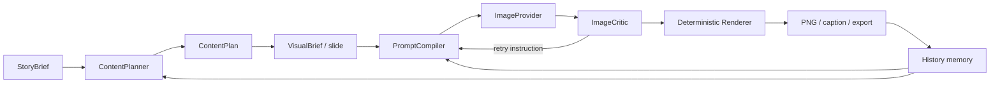

# Architecture

## 1. 设计目标

MyWorkshop 的核心不是“更长的 Prompt”，而是把随机生图改造成一条可审计的生产流水线。

## 2. 两个合同

### 内容合同

`StoryBrief` 和 `ContentPlan` 决定：

- 给谁看；
- 在什么场景使用；
- 一组内容承诺解决什么；
- 每页承担什么叙事任务；
- 哪些陈述需要来源；
- 哪些表达属于高风险。

### 视觉合同

`VisualBrief` 决定：

- 唯一主视觉；
- 对象数量；
- 对象状态；
- 必须出现项；
- 禁止出现项；
- 镜头、光线、背景；
- 后续排版需要的安全区。

把两个合同分开，是为了避免“文案正确但图错了”或者“图漂亮但表达了不存在的事实”。

## 3. Provider 边界

- `OpenAICompatibleTextProvider` 只负责把简报转换成 JSON。
- `ImageProvider` 只生成无文字视觉素材。
- `ImageCritic` 只检查素材是否满足视觉合同。
- `Renderer` 不调用模型，它使用固定设计令牌生成最终中文页面。

所有外部模型都可以替换；内容合同、品牌配置和项目文件结构保持不变。

## 4. 故障处理

- 文本 JSON 不合法：第一次校验失败后，带校验错误进行一次完整修复。
- 图片 API 拒绝扩展字段：自动退回最小请求体。
- 视觉审查失败：把问题编译成定向纠偏 Prompt，最多按配置重试。
- 远程视觉审查不可用：保留本地尺寸/空白检查和观察记录，不删除有效素材。
- 任一阶段异常：项目状态写为 `failed`，错误保存在项目目录，已生成资产不丢失。

## 5. 数据与密钥

- API Key 仅从环境变量读取，不写入项目 manifest。
- 浏览器只向本机 FastAPI 提交选题，不接触密钥。
- 项目和参考图默认保存在本机 `workspace/`，并由 `.gitignore` 排除。
- `export.zip` 只包含该项目的生产资产，不包含 `.env` 和全局参考库。
